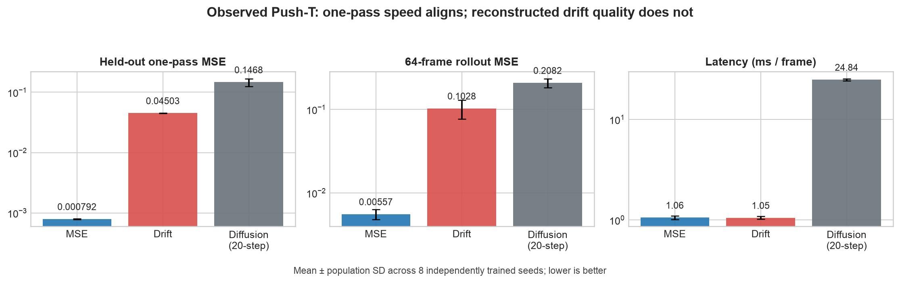

# Reproducing DriftWorld on Push-T



**Assessment: partially reproduced.** The one-pass speed claim aligned, but the reported quality advantage did not appear in this bounded reconstruction. Across eight independently trained seeds, the matched MSE model reached **0.000792 held-out MSE** and **0.00557 64-frame rollout MSE**. The reconstructed drifting field reached **0.04503** and **0.10285**, respectively. Both one-pass models took about **1.05 ms/frame**, versus **24.84 ms/frame** for a 20-step diffusion timing reference. The Drift model reacted measurably but weakly to actions; true actions improved held-out MSE over shuffled actions by only **7.18×10⁻⁷**.

[](https://molab.marimo.io/github/alphaXiv/driftworld-7f8c73f9/blob/main/notebooks/driftworld_reproduction.py)

The exact public Molab URL is <https://molab.marimo.io/github/alphaXiv/driftworld-7f8c73f9/blob/main/notebooks/driftworld_reproduction.py>.

## The question

DriftWorld asks whether a generator can learn an action-conditioned video distribution by following a one-step *drifting field*: attraction toward the demonstrated future and repulsion from generated or static negatives. If that fixed-point objective works, it should combine diffusion-like visual quality with the latency of one neural-network pass.

The paper reports on Push-T that DriftWorld improves 64-frame MSE from **0.0035 to 0.0007** relative to a one-pass MSE model, while both take **3.7 ms/frame** on an H100. This reproduction tests the direction of the quality effect, long-rollout behavior, action dependence, and the one-pass latency advantage.

## What was implemented

The author repository was a placeholder, so preprocessing and the drifting update were reconstructed from the paper and appendix. The important code path is in [`reproduce.py`](../../reproduce.py):

1. Read the public Diffusion Policy Push-T demonstrations: 25,650 RGB frames in 206 episodes.
2. Hold out the last 50 episodes, producing 18,043 train windows and 6,165 test windows. Every example contains four 96×96 history frames, four future actions, and four future frames.
3. Condition a factorized spatiotemporal U-Net on actions through FiLM. Its spatial blocks operate per frame, depthwise temporal convolutions exchange information across the four-frame chunk, and bottleneck attention operates at 12×12 resolution.
4. Train the same architecture either with direct pixel MSE or with the reconstructed pixel-space drifting field. For each pixel, the field attracts eight generated candidates toward the target and repels them from generated peers and the repeated current frame, using temperatures 0.02, 0.05, and 0.2.
5. Evaluate fixed held-out windows, eight 64-frame autoregressive rollouts, shuffled-action sensitivity, and synchronized CUDA latency. A cosine-schedule, 20-step DDIM model supplies a matched iterative timing reference.

The drifting update is a stopped-gradient target rather than a conventional regression label:

```python
pred = model(noise, history, actions)
field = normalized_drift(pred, target, current_frame, [0.02, 0.05, 0.2])
loss = mse(pred, (pred + field).detach())
```

This implementation preserved the paper's resolution, history/horizon, base width, residual-block count, negative count, temperatures, learning rate, weight decay, warmup, clipping, and EMA decay. Consequential substitutions were unavoidable:

- The reconstructed network has **4.80M parameters**, not the paper's **8.73M**, because layer-by-layer source code was unavailable.
- Training was bounded to **6,000 updates per seed**, batch 2, rather than the paper's unreported total training duration.
- Eight GPUs trained eight independent complete models per objective. Gloo coordinated metric collection only after NCCL communicator creation stalled on this cluster.
- The public Push-T archive and held-out split may differ from the authors' data version and split.
- LPIPS and policy-ranking evaluation were omitted. The diffusion model is intentionally a small timing reference and is too undertrained for a quality comparison.

## Observed evidence

All values below are means across eight independently trained seeds; uncertainty is population standard deviation. Every plotted value is stored in [`evidence.json`](evidence.json), transcribed from terminal `FINAL_RESULT_JSON` blocks.

| Model | Held-out MSE ↓ | Held-out SSIM ↑ | 64-frame MSE ↓ | 64-frame SSIM ↑ | Latency ms/frame ↓ |
|---|---:|---:|---:|---:|---:|
| MSE one-pass | 0.000792 ± 0.000012 | 0.97372 | 0.00557 ± 0.00076 | 0.88245 | 1.058 ± 0.044 |
| Drift one-pass | 0.045031 ± 0.000219 | 0.88298 | 0.10285 ± 0.02580 | 0.54635 | 1.052 ± 0.034 |
| Diffusion, 20 steps | 0.14677 ± 0.02137 | 0.23686 | 0.20815 ± 0.02557 | 0.16884 | 24.840 ± 0.584 |

The paired architecture comparison is decisive under this setup: Drift's held-out MSE was **56.9× higher** than MSE, and its rollout MSE was **18.5× higher**. Eight seeds make this unlikely to be a single unlucky initialization, but they do not resolve uncertainty in the reconstructed field, network details, or training duration.

The speed result is equally clear. MSE and Drift differed by less than 1% in per-frame latency because both generate four frames with one forward pass. The 20-step reference was **23.6× slower than Drift**. Its poor visual scores only show that 6,000 updates are insufficient for this compact diffusion setup; they are not evidence against iterative diffusion quality.

Action dependence was measured two ways:

| Model | Output change under shuffled actions, L1 ↑ | True-action MSE advantage over shuffled ↑ |
|---|---:|---:|
| MSE one-pass | 0.001196 | 5.47×10⁻⁶ |
| Drift one-pass | 0.000992 | 7.18×10⁻⁷ |
| Diffusion, 20 steps | 0.006095 | 1.14×10⁻⁵ |

The Drift advantage was positive in all eight seeds, so the output is action-conditioned in a measurable sense. Its magnitude is tiny and weaker than the MSE control, so this run does not establish the paper's stronger claim of useful action-conditioned rollouts.

## Claim-by-claim assessment

| Claim | Paper evidence | Observed evidence | Assessment | Compute |
|---|---|---|---|---|
| Drifting improves Push-T prediction over a same-architecture MSE model | 64-frame MSE 0.0035 → 0.0007; SSIM 0.9704 → 0.9925 | Held-out MSE 0.000792 → 0.045031; rollout MSE 0.00557 → 0.10285 | **Did not align under this setup.** The tested reconstruction showed the opposite direction. Missing source details, 4.80M-vs-8.73M parameters, 6,000 updates, and data/split differences limit the inference. | MSE: 8 GPUs, 4m47s job / 170.0s script. Drift: 8 GPUs, 13m03s job / 662.4s script. |
| One-pass models are substantially faster than iterative diffusion | Paper latency 3.7 ms/frame for one-pass models versus 10.4 ms/frame for GPC | Drift 1.052 and MSE 1.058 ms/frame versus 24.840 ms/frame for 20-step DDIM | **Aligned.** Drift was 23.6× faster than the iterative reference. Absolute timing is hardware- and implementation-specific. | Three 8-GPU jobs; diffusion 4m06s job / 207.7s script. |
| Drift preserves useful action-conditioned rollouts | Qualitative and policy evidence in the paper | True actions reduced MSE by 7.18×10⁻⁷ over shuffled actions; rollout MSE 0.10285 | **Inconclusive under this setup.** Action dependence was consistent but too small, and policy ranking was not attempted. | Included in the Drift evaluation above. |

## Robustness and evidence boundaries

The paper does not state an explicit multiplier for its fixed-point drift update. Two single-factor checks changed only that multiplier. Neither repaired quality, which is expected under Adam's approximate scale invariance. A 20,000-update run also remained poor. Values are eight-seed means:

| Full reconstructed field | Held-out MSE ↓ | 64-frame MSE ↓ |
|---|---:|---:|
| Scale 1.0, 6k updates | 0.04503 | 0.10285 |
| Scale 0.1, 6k updates | 0.04495 | 0.10346 |
| Scale 0.01, 6k updates | 0.04484 | 0.10416 |
| Scale 1.0, 20k updates | 0.04676 | 0.09820 |

The more revealing test decomposed the reconstructed field. Removing both repulsive terms and retaining attraction alone reduced held-out MSE to **0.001400** and produced **0.004318** rollout MSE—still worse than direct MSE on held-out windows, but better than its 0.00557 rollout result. Extending attraction-only training to 20,000 updates improved those values to **0.001083** and **0.003926**. Adding only the static-frame negative raised held-out MSE to 0.01673 and caused three seeds to collapse to an action-insensitive constant predictor. Adding only peer negatives raised it to 0.05128. Thus the observed discrepancy localizes to the reconstructed repulsion rather than the one-pass integrator or action-FiLM path. Because the authors' exact field implementation is unavailable, this is a diagnostic of our reconstruction, not an ablation of their code.

The initial Kubernetes jobs terminated before Python because the injected script was quoted incorrectly. Successor runs fixed the manifest and then replaced stalled NCCL synchronization with Gloo control plus independent models. Those setup attempts produced no metrics and are excluded from every plot and claim assessment.

The formal experiments used the configured **Kubernetes** backend on **NVIDIA RTX PRO 6000 Blackwell** GPUs, with a **peak allocation of 16 concurrent GPUs**. The measured campaign wall time is reported in `autoresearch.json` after the final sensitivity run; individual durations above come directly from OpenResearch status and terminal logs.

## What a full reproduction still needs

A stronger test needs the authors' exact layer graph, data normalization and split, drift-field constants, training duration, evaluation sampling protocol, and policy checkpoints. It should match the 8.73M-parameter network, train to convergence, add LPIPS, evaluate the paper's 64-frame protocol exactly, and run Push-T policy ranking. Until those details exist, the quality result should be read narrowly: **this public-data, bounded reconstruction did not show the reported Drift-over-MSE effect; the latency advantage did reproduce.**

Important experiment branches: [MSE control](https://github.com/alphaXiv/driftworld-7f8c73f9/tree/orx/mse-independent-seeds), [primary drifting field](https://github.com/alphaXiv/driftworld-7f8c73f9/tree/orx/drift-independent-seeds), [20-step diffusion reference](https://github.com/alphaXiv/driftworld-7f8c73f9/tree/orx/20-step-diffusion-independent-seeds), [drift scale 0.1](https://github.com/alphaXiv/driftworld-7f8c73f9/tree/orx/drift-step-scale-0-1), and [drift scale 0.01](https://github.com/alphaXiv/driftworld-7f8c73f9/tree/orx/drift-step-scale-0-01).
