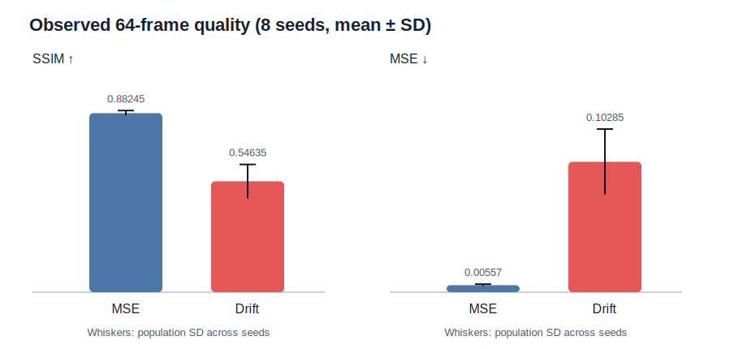
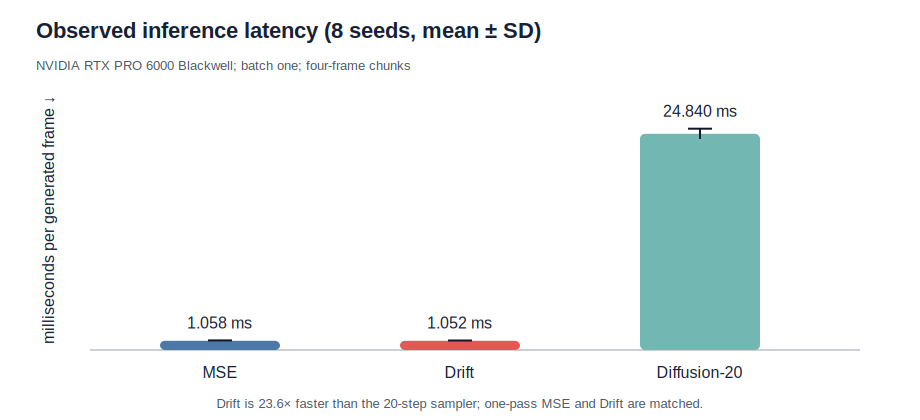

# DriftWorld on Push-T: a partial reproduction

The central question is simple: can a world model move the cost of iterative generation into training, then predict action-conditioned video in one forward pass without sacrificing quality? *DriftWorld* reports that it can. We reconstructed the paper's pixel-space drifting objective and action-FiLM video U-Net, then compared it with direct MSE and a 20-step diffusion reference on public Push-T demonstrations.

Our result is mixed. One-pass speed reproduced decisively, but the reported drifting quality advantage did not appear in this bounded reconstruction. Across eight seeds, the MSE control was substantially better on both held-out chunks and 64-frame autoregressive rollouts. Drift retained a small, consistently positive true-action advantage over shuffled actions, but the signal was too weak—and the rollouts too inaccurate—to support the useful-rollout portion of the claim.

**Overall verdict: partially reproduced.** Kubernetes was used throughout on NVIDIA RTX PRO 6000 Blackwell Server Edition GPUs, with 16 GPUs allocated concurrently at peak. The compute campaign took 0.541 elapsed wall hours (2026-07-20 09:35:13Z–10:07:39Z).

The self-contained [marimo tutorial](../../notebooks/driftworld_reproduction.py) opens with these results. The exact public Molab URL is <https://molab.marimo.io/github/alphaXiv/driftworld-7f8c73f9/blob/main/notebooks/driftworld_reproduction.py>.

## What the paper claims

For 64-frame Push-T rollouts, Table 1 reports that DriftWorld improves over its same-backbone MSE control: MSE 0.0007 versus 0.0035, SSIM 0.9925 versus 0.9704, and PSNR 33.775 versus 28.058 dB. Both are one-pass models at 3.7 ms/frame on an H100. The iterative GPC diffusion model is reported at 10.4 ms/frame.

The mechanism is a conditional attraction-repulsion field. For each generated sample, a kernel-weighted vector attracts it toward the one ground-truth future and repels it from generated negatives. The model regresses to a stop-gradient target offset by that field. On Push-T, the paper computes this directly in pixel space with eight negatives and aggregates normalized fields at temperatures 0.02, 0.05, and 0.2.

## Implementation

The consequential path is in `reproduce.py`:

1. Four 96×96 RGB history frames and four future 2-D actions condition a factorized spatial-temporal U-Net. Per-frame FiLM ensures action *t+i* modulates predicted frame *t+i+1*.
2. The MSE control calls the generator once and minimizes pixel MSE.
3. Drift expands each conditioning item to eight Gaussian-noise predictions. At every pixel, the flattened time×RGB vector receives the normalized, multi-temperature attraction-minus-repulsion field; the network regresses to the detached drifted target.
4. The diffusion reference uses the identical U-Net for cosine noise prediction and deterministic 20-step DDIM sampling.
5. Every objective trains eight independent seeds in parallel—one complete model per GPU—then reports means, standard deviations, and all seed values.

This reconstruction has 4.80M parameters, below the paper's stated 8.73M. It keeps the reported base width 96 and two residual blocks but uses attention only at the deepest 8× downsampled resolution. The author repository was a placeholder, so unspecified kernel and U-Net details were reconstructed from the paper text.

## Protocol and substitutions

We used the public Diffusion Policy Push-T replay: 25,650 frames in 206 episodes. The last 50 complete episodes form a fixed holdout, yielding 18,043 training windows and 6,165 test windows. Every method received 6,000 AdamW updates with batch size two per seed, learning rate 1.25×10⁻⁵, 500-step warmup, cosine decay, β=(0.9, 0.95), weight decay 0.01, gradient clipping 2.0, and EMA 0.999.

The paper instead states 500 expert and random-exploration trajectories, but does not release that exact mixture or its training duration. We therefore changed dataset size/composition, total updates, parameter count, some attention placement, and likely low-level drifting-field details. LPIPS was omitted to keep the test focused and dependency-free. The 20-step diffusion model is deliberately a small latency reference; at 6,000 updates its quality is undertrained and should not be read as a competitive diffusion baseline.

## Observed evidence

| Metric, mean ± SD over 8 seeds | MSE control | Drift | 20-step diffusion |
|---|---:|---:|---:|
| Held-out chunk MSE ↓ | **0.000792 ± 0.000012** | 0.045031 ± 0.000219 | 0.146773 ± 0.021366 |
| Held-out chunk SSIM ↑ | **0.97372 ± 0.00032** | 0.88298 ± 0.00301 | 0.23686 ± 0.01594 |
| 64-frame MSE ↓ | **0.005570 ± 0.000758** | 0.102847 ± 0.025804 | 0.208154 ± 0.025572 |
| 64-frame SSIM ↑ | **0.88245 ± 0.01258** | 0.54635 ± 0.08331 | 0.16884 ± 0.01828 |
| Latency, ms/frame ↓ | **1.058 ± 0.044** | **1.052 ± 0.034** | 24.840 ± 0.584 |
| True-action minus shuffled-action MSE gain ↑ | 5.47×10⁻⁶ | 0.718×10⁻⁶ | 11.40×10⁻⁶ ± 16.42×10⁻⁶ |

All plotted and tabulated values are embedded in `results.json` and originate from terminal `FINAL_RESULT_JSON` blocks. Drift's best seed still had 64-frame MSE 0.07026, more than ten times the MSE control's worst seed (0.00671), so the quality reversal is not a seed-selection artifact.

The speed result is clear within hardware: the iterative sampler was 23.6× slower than Drift, while Drift and MSE were effectively matched. Absolute paper and reproduction timings should not be compared directly because the paper used an H100 and this work used Blackwell GPUs.

Action conditioning is more cautious. Shuffling actions increased Drift's held-out MSE in all eight seeds, but only by 0.718×10⁻⁶ on average, versus 5.47×10⁻⁶ for MSE. That consistent sign shows the generator was not perfectly action-agnostic; its magnitude and poor autoregressive quality do not demonstrate useful action-conditioned rollouts.

## Claim-by-claim assessment

| Claim | Paper result | Observed result | Assessment |
|---|---|---|---|
| Drifting improves Push-T quality over same-architecture MSE | 64-frame MSE 0.0007 vs 0.0035; SSIM 0.9925 vs 0.9704 | MSE 0.10285 vs 0.00557; SSIM 0.54635 vs 0.88245 | **Not aligned in this reconstructed setup.** This run showed a large reversal; the unreleased data mixture, schedule, smaller U-Net, and reconstructed field are material uncertainties. |
| One-pass models are substantially faster than iterative diffusion | Drift/MSE 3.7 ms vs GPC 10.4 ms on H100 | Drift/MSE 1.052/1.058 ms vs 24.840 ms for 20-step diffusion on Blackwell | **Aligned.** The matched iterative sampler was 23.6× slower than Drift. |
| Drift preserves useful action-conditioned rollouts | Qualitative 140-frame rollouts track the action-conditioned Push-T dynamics | Action shuffle gain was positive in 8/8 seeds but tiny; 64-frame SSIM was 0.546 | **Inconclusive under this setup.** Conditioning was measurable but did not yield useful long rollouts. |

## Compute and provenance

The exact run command on every experiment was `bash run.sh`. Kubernetes jobs used NVIDIA RTX PRO 6000 Blackwell Server Edition GPUs. MSE, Drift, and diffusion each allocated eight GPUs; MSE and Drift ran together, then diffusion refilled MSE's freed eight GPUs, giving a peak of 16 concurrent GPUs.

| Experiment | Train/eval wall | Kubernetes job wall | Branch |
|---|---:|---:|---|
| MSE, 8 seeds | 170.0 s | 4m47s | [MSE independent seeds](https://github.com/alphaXiv/driftworld-7f8c73f9/tree/orx/mse-independent-seeds) |
| Drift, 8 seeds | 662.4 s | 13m03s | [Drift independent seeds](https://github.com/alphaXiv/driftworld-7f8c73f9/tree/orx/drift-independent-seeds) |
| 20-step diffusion, 8 seeds | 207.7 s | 4m06s | [Diffusion independent seeds](https://github.com/alphaXiv/driftworld-7f8c73f9/tree/orx/20-step-diffusion-independent-seeds) |

Several short setup attempts produced no optimization steps: the Kubernetes script required explicit evaluation, and NCCL communicator setup stalled on this cluster. The final implementation used Gloo only for CPU coordination and trained one independent model per GPU. These diagnostics are excluded from scientific comparisons but included in the 0.541-hour campaign wall time.

## What a full reproduction still needs

A decisive quality test requires the authors' exact 500-trajectory expert/random mixture, full 8.73M U-Net including both attention resolutions, precise mean-shift normalization code, training duration/checkpoints, and LPIPS implementation. Longer drifting training is particularly important: its training objective was still noisy at 6,000 steps, whereas direct MSE converged quickly. A competitive diffusion comparison likewise needs a tuned sampler and substantially longer training. The present evidence establishes the speed consequence of one-pass generation, but it does not establish the paper's quality or useful-rollout gains.
